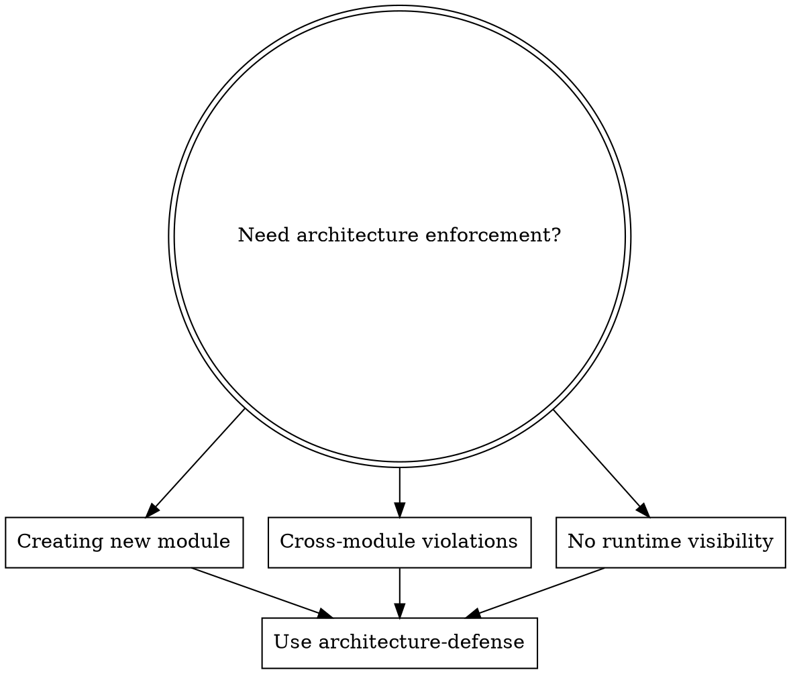

# Architecture Defense

## Overview
**Architecture = Code.** Structure is defined by metadata within the code itself, not external documentation.

A self-defending codebase has four vital signs (J1-J4):
- **J1 Self-Description**: Each module has a "manifest" declaring boundaries
- **J2 Self-Check**: Built-in linters validate architecture continuously
- **J3 Closed Rules**: Rules apply to the build process itself
- **J4 Reflex**: Violations cause "system shock" (CI block)

**The goal**: Wrong dependency calls are rejected before they leave the developer's machine.

## When to Use



**Symptoms:**
- "Who owns this module?"
- "Why can UI import from database layer?"
- "Circular dependency hell"
- "Documentation doesn't match actual structure"

## J1: Self-Description (Module Manifest)

### Required Manifest Structure

Every feature module MUST have a manifest:

```typescript
// src/features/[feature-name]/manifest.config.ts
export const moduleManifest = {
  // Module identity
  id: "feature.user-profile",
  owner: "team-platform",  // Who owns this module

  // Public API contract
  publicApi: "./index.ts",  // Single legal entry point

  // Dependency whitelist (what I CAN import)
  canImportFrom: [
    "src/shared/utils/**",
    "src/features/*/index.ts"  // Only public APIs of other features
  ],

  // Defense rules
  restrictions: {
    disallowDeepImport: true  // Block: import from ../../feature/other/internal/
  }
};
```

### Directory Pattern

```
src/features/[module]/
├── manifest.config.ts    ← REQUIRED: Module ID card
├── index.ts              ← REQUIRED: Public API entry
├── api/                  ← Public: What consumers use
├── internal/             ← Private: Implementation details
│   ├── services/
│   ├── utils/
│   └── types/
└── __tests__/
```

### Manifest Anti-Patterns

| Pattern | Problem |
|---------|---------|
| No manifest file | No self-description, no automated validation |
| Manifest without owner | Nobody accountable when architecture breaks |
| Multiple public exports | Fragmented API, hard to track dependencies |

## J2: Self-Check (Frontend: dependency-cruiser)

### Installation

```bash
npm install --save-dev dependency-cruiser
```

### Core Configuration

```javascript
// dependency-cruiser.config.cjs
module.exports = {
  forbidden: [
    // Rule 1: Block cross-feature internal imports
    {
      name: 'no-cross-feature-internal',
      comment: 'Features must import through index.ts only',
      severity: 'error',
      from: { path: '^src/features/([^/]+)/.+' },
      to: {
        path: '^src/features/([^/]+)/.+'`,
        pathNot: '^src/features/\\2/index\\.ts$'
      }
    },

    // Rule 2: Block UI → Database coupling
    {
      name: 'no-ui-to-db',
      comment: 'UI cannot depend on database models',
      severity: 'error',
      from: { path: '^src/(ui|components)/' },
      to: { path: '^src/(database|models)/' }
    },

    // Rule 3: No circular dependencies
    {
      name: 'no-cycles',
      comment: 'Circular dependencies detected',
      severity: 'error',
      from: { path: '^src/' },
      to: { path: '^src/' },
      cycle: true
    }
  ]
};
```

### NPM Scripts

```json
{
  "scripts": {
    "check:arch": "depcruise --config dependency-cruiser.config.cjs src/",
    "check:arch:graph": "depcruise --config dependency-cruiser.config.cjs src/ --output-type dot | dot -T svg > arch.svg"
  }
}
```

## J2: Self-Check (Backend: ArchUnit)

### Installation

```xml
<!-- pom.xml or build.gradle -->
<testImplementation>
    <dependency>
        <groupId>com.tngtech.archunit</groupId>
        <artifactId>archunit-junit5</artifactId>
        <version>1.3.0</version>
    </dependency>
</testImplementation>
```

### Architecture Test Class

```java
// src/test/java/com/company/ArchitectureTest.java
@AnalyzeClasses(packages = "com.company")
public class ArchitectureTest {

    @ArchTest
    public static final ArchRule no_cycles =
        slices().matching("com.company.features.(*)..")
                .should().beFreeOfCycles();

    @ArchTest
    public static final ArchRule controller_not_depend_on_repository =
        noClasses().that().resideInAPackage("..controller..")
                .should().dependOnClassesThat()
                .resideInAPackage("..repository..")
                .because("Must go through service layer");

    @ArchTest
    public static final ArchRule domain_not_depend_on_infrastructure =
        noClasses().that().resideInAPackage("..domain..")
                .should().dependOnClassesThat()
                .resideInAPackage("..infrastructure..");
}
```

## J3: Closed Rules (CI Integration)

### Pre-commit Hook

```bash
# .husky/pre-commit
npx depcruise --config dependency-cruiser.config.cjs $(git diff --cached --name-only | grep '\.tsx?$')
```

### GitHub Actions

```yaml
# .github/workflows/architecture.yml
name: Architecture Check

on:
  pull_request:
  push:
    branches: [main]

jobs:
  architecture:
    runs-on: ubuntu-latest
    steps:
      - uses: actions/checkout@v4
      - run: npm ci
      - run: npm run check:arch
      # Run ArchUnit tests for backend
      - run: mvn test -Dtest=ArchitectureTest
```

### CODEOWNERS Integration

```text
# CODEOWNERS
# Manifest changes require module owner approval
src/features/*/manifest.config.ts @platform-team

# Public API changes require approval
src/features/*/index.ts @platform-team
```

## J4: Reflex (Violation Response)

### Severity Levels

| Severity | Action | Use Case |
|----------|--------|----------|
| `error` | Blocks commit, fails CI | Critical violations (cycles, layer crossing) |
| `warn` | Comments on PR, doesn't block | Style issues, minor coupling |

### Violation Message Template

```bash
✖ src/features/auth/ui/Login.tsx → src/features/user/internal/api.ts
  ⚠ no-cross-feature-internal

  Features cannot import other features' internal files.

  Fix: Import from src/features/user/index.ts instead

  Module owner: @team-platform
```

## Runtime Introspection

### Vite Plugin for Runtime Architecture

```typescript
// vite.config.ts
import { readFileSync } from 'fs';
import { globSync } from 'fast-glob';

function archInjectPlugin() {
  return {
    name: 'arch-introspection',
    transformIndexHtml(html) {
      const manifests = globSync('src/**/manifest.config.ts')
        .map(f => ({
          module: f.match(/features\/([^/]+)\//)?.[1],
          ...JSON.parse(readFileSync(f, 'utf-8'))
        }));

      return html.replace(
        '</head>',
        `<script>window.__ARCH__ = ${JSON.stringify(manifests)};</script></head>`
      );
    }
  };
}
```

### Runtime Usage

```javascript
// In browser console
window.__ARCH__.find(m => m.id === 'feature.user-profile')
// → { id: "feature.user-profile", owner: "team-platform", ... }

// Find owner for debugging
const getOwner = (module) => window.__ARCH__.find(m => m.id === module)?.owner;
```

## Quick Reference Checklist

**For Each New Module:**
- [ ] Created `manifest.config.ts` with id, owner, publicApi
- [ ] Single `index.ts` entry point
- [ ] Internal code in `internal/` subdirectory
- [ ] Added to dependency-cruiser config if needed

**For Existing Codebase:**
- [ ] Installed dependency-cruiser (frontend) or ArchUnit (backend)
- [ ] Configured forbidden rules
- [ ] Added pre-commit hooks
- [ ] Added CI workflow
- [ ] Set up CODEOWNERS for manifest changes
- [ ] Enabled runtime introspection (optional)

## Common Anti-Patterns

| Anti-Pattern | Description | Fix |
|-------------|-------------|-----|
| **No manifest** | Module exists without self-description | Create manifest.config.ts |
| **Deep imports** | `import from ../../feature/internal/util` | Import from index.ts, move util to shared |
| **UI → DB** | Components import models | Create type layer, transform in service |
| **Manual reviews** | Architecture reviewed by humans | Automate with tools |
| **Drifting docs** | Docs ≠ actual structure | Auto-generate from code |
| **"This is legacy"** | Old code bypasses rules | All code follows same rules |
| **"It's shared utils"** | Shared modules bypass rules | Shared modules also need manifests |

## Legacy Codebase Strategy

For existing codebases without manifests, use **grandfathering with TODOs**:

```typescript
// src/features/legacy-module/manifest.config.ts
export const moduleManifest = {
  id: "feature.legacy-module",
  owner: "team-backend",
  publicApi: "./index.ts",
  canImportFrom: ["src/shared/**"],

  // Mark as legacy for tracking
  tags: ["legacy", "needs-refactor"],

  // Target date for compliance
  complianceTarget: "2025-06-01"
};
```

### Grandfathering Rules

| Status | Rule | Deadline |
|--------|------|----------|
| **New code** | Full compliance (manifest + rules) | Immediately |
| **Modified code** | Add manifest before commit | Before PR merge |
| **Untouched legacy** | Add minimal manifest (id, owner) | Within 2 weeks |
| **Legacy hotfix** | Add manifest with `exception: true` | Before deployment |

```typescript
// For emergency hotfixes
export const moduleManifest = {
  id: "feature.emergency-fix",
  owner: "team-on-call",
  exception: true,  // Temporary exemption
  exceptionReason: "Critical hotfix - PROD-1234",
  reviewDate: "2025-01-15"  // Must be reviewed by this date
};
```

## Gradual Rollout Strategy

### Phase 1: Discovery (Week 1-2)
```javascript
// dependency-cruiser.config.cjs - WARNING mode only
{
  name: 'no-cross-feature-internal',
  severity: 'warn',  // Just warn, don't block
  comment: 'Planning phase: tracking violations'
}
```

### Phase 2: Block New Violations (Week 3-4)
```javascript
// New violations fail, existing allowed with TODO
{
  name: 'no-cross-feature-internal',
  severity: 'error',
  allowedInComments: ['ARCH-EXCEPT:', 'LEGACY:']
}
```

Usage:
```typescript
// LEGACY: Temporary exception - refactor by 2025-03-01
import { internalUtil } from '../other-feature/internal/util';
```

### Phase 3: Full Enforcement (Week 5+)
```javascript
// No exceptions, all violations block
{
  name: 'no-cross-feature-internal',
  severity: 'error',
  allowedInComments: []  // Empty = no exceptions allowed
}
```

## Shared Modules

Shared utility modules ALSO need manifests:

```typescript
// src/shared/utils/manifest.config.ts
export const moduleManifest = {
  id: "shared.utils",
  owner: "team-platform",
  publicApi: "./index.ts",

  // Shared modules declare WHO can use them
  usedBy: [
    "src/features/**/*",  // All features can use
    "src/admin/**/*"
  ],

  restrictions: {
    disallowDeepImport: true,
    // Shared modules can depend on each other
    allowSharedDependencies: true
  }
};
```

**Shared module directory pattern:**
```
src/shared/
├── utils/
│   ├── manifest.config.ts  ← Required
│   ├── index.ts            ← Public API
│   └── internal/
├── ui-components/
│   ├── manifest.config.ts  ← Required
│   └── index.ts
└── types/
    ├── manifest.config.ts  ← Required
    └── index.ts
```

## Rationalization Block

| Excuse | Reality |
|--------|---------|
| "Manifests are overhead" | No manifest = no ownership = nobody accountable |
| "We'll review manually" | Manual reviews miss violations; tools don't sleep |
| "We'll fix later" | Architecture decay is exponential; fix costs grow 10x |
| "CI is too strict" | Blocks prevent breaking the foundation the app stands on |
| "Runtime introspection is bloat" | Debugging without it is guessing; with it is surgery |
| "Our team is small" | Small teams need structure more than large ones |
| "This is legacy code" | Legacy still rots; add manifest with tags: ["legacy"] |
| "It's shared utils" | Shared modules also need manifests; declare usedBy |
| "Production emergency" | Use exception: true + reviewDate; still needs manifest |
| "We're not ready yet" | Use gradual rollout: warn → error over 4 weeks |
| "Just this one time" | One exception becomes ten; use ARCH-EXCEPT: with date |
| "The refactor is too big" | Add minimal manifest (id, owner) first; fix later |

**Red Flags - STOP and Reconsider:**

- "I'll add the manifest later"
- "This is shared, so it doesn't need rules"
- "Legacy code is grandfathered in"
- "It's an emergency hotfix"
- "We'll do a big refactor later"

**All of these mean: Add the manifest NOW.** The file takes 2 minutes to create.

**Violating these rules violates the system's immune system.** No exceptions.
