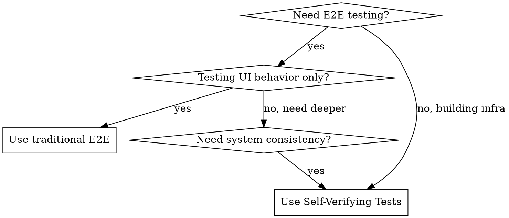

# Self-Verifying Tests

## Overview

Traditional E2E tests verify "user clicks → UI shows success". Self-verifying tests verify "system narrative remains consistent". We test not just behavior, but **self-consistency**.

**Core principle:** Hidden bugs live in the gap between "UI looks fine, internal structure is broken". Cross-layer validation eliminates this blind spot.

## When to Use



**Use when:**
- Writing E2E tests for manifest-configured modules
- Building test infrastructure or generators
- Need to verify UI ↔ Database consistency
- Testing state machine transitions
- Validating doc-code alignment

**Don't use for:**
- Simple UI smoke tests (use traditional E2E)
- Unit tests (use Vitest/Jest)
- Visual regression (use dedicated tools)

## Four Verification Layers

### Layer 1: Manifest-Driven Generation
Read `manifest.config.ts` → Generate test skeleton automatically.

### Layer 2: Cross-Layer Validation (Shadow Inspector)
UI action + Database verification + Audit log check.

### Layer 3: State Symmetry (FSM)
Model-based testing of state transitions.

### Layer 4: Doc-Code Integrity
Verify documentation matches code before tests run.

## Quick Reference

| Layer | Command | What It Verifies |
|-------|---------|------------------|
| Generate | `npm run test:generate` | Manifest → test skeleton |
| Shadow | `verifyInvariant(page, id)` | UI === DB === Audit |
| FSM | `test:gremlin` | State transition legality |
| Doc Check | `npm run test:doc-integrity` | Doc ↔ Code alignment |

## Implementation

### Test Generator

```typescript
// Scan all manifests and generate tests
const scanner = new ManifestScanner()
const manifests = await scanner.scanAll()

for (const m of manifests) {
  // Generates: test.describe(`@manifest:${m.id}`, () => {...})
  generateTestSkeleton(m)
}
```

### Shadow Inspector Pattern

```typescript
test('archive: shadow invariant check', async ({ page }) => {
  await page.click('[data-testid="archive-submit"]')
  const id = await page.evaluate(() => window.lastArchiveId)

  // Critical: Verify database directly
  const dbRecord = await db.query('SELECT * FROM archives WHERE id = $1', [id])
  const auditLog = await db.query('SELECT * FROM audit_logs WHERE entity_id = $1', [id])

  // Invariant: UI === DB === Audit
  expect(dbRecord.status).toBe('ARCHIVED')
  expect(auditLog.length).toBeGreaterThan(0)
})
```

### FSM State Testing

**CRITICAL:** Never hard-code or assume current state in Gremlin tests. Always fetch actual state from DB or UI.

```typescript
test('gremlin: random transitions respect FSM', async ({ page }) => {
  for (let i = 0; i < 100; i++) {
    // MUST fetch real state, never assume!
    const state = await getCurrentStateFromDB(page) // or UI
    const valid = validTransitions.filter(t => t.from === state)
    const action = valid[Math.floor(Math.random() * valid.length)]

    await page.click(`[data-action="${action.trigger}"]`)
    const newState = await getCurrentStateFromDB(page)

    expect(validStates).toContain(newState) // Always valid
  }
})

// Helper: Get state from database (preferred)
async function getCurrentStateFromDB(page: Page): Promise<string> {
  const id = await page.evaluate(() => window.currentEntityId)
  const response = await fetch(`/api/pages/${id}`)
  const data = await response.json()
  return data._status // 'draft' or 'published'
}
```

## Common Mistakes

| Mistake | Why It's Wrong | Fix |
|---------|----------------|-----|
| Only checking UI toast | Can miss DB corruption | Always verify DB state |
| Hard-coded test cases | Maintenance nightmare | Generate from manifest |
| Testing happy path only | Misses edge cases | Use FSM random testing |
| Ignoring doc drift | Future bugs from outdated docs | Run doc-integrity check |
| **Assuming state in Gremlin tests** | Defeats the purpose of state testing | Fetch real state from DB/API |

## File Structure

```
~/.claude/skills/self-verifying-tests/
├── SKILL.md                    # This file
├── generators/
│   ├── manifest-scanner.ts     # Scan manifest.config.ts files
│   └── playwright-generator.ts # Generate test skeletons
├── validators/
│   ├── shadow-inspector.ts     # UI-DB verification helper
│   └── doc-integrity.ts        # Doc-code alignment checker
└── templates/
    └── e2e-test.template.ts    # Test generation template
```

## Red Flags - You're Doing It Wrong

- "I just check the toast message" → You're missing the point
- "We'll write tests manually" → Violates manifest-driven principle
- "State testing is overkill" → That's where the bugs hide
- "Docs are separate concern" → Doc drift causes future bugs
- **"I'll assume current state for simplicity"** → Defeats state machine testing
- **"Fetching DB state is too complex"** → That's the entire point of Shadow Inspector

**All of these mean: Re-read the Overview.**
