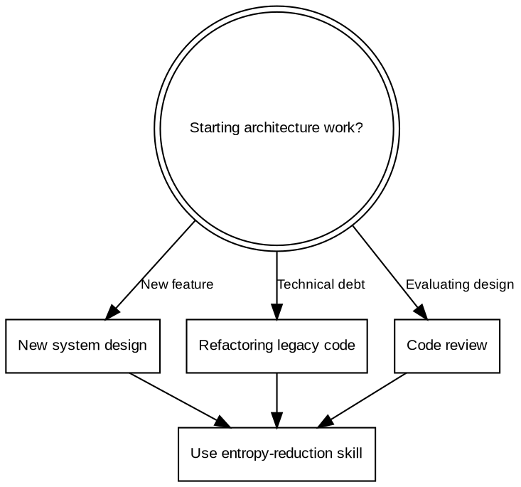

# Entropy Reduction

## Overview
Modularization = encapsulating **cognitive load**, not splitting files. A module is a black box: external callers know **WHAT** it does, not **HOW** it works.

**The boundary is the interface.** If changing internal implementation affects external code, the boundary is wrong.

## When to Use



**Symptoms that indicate this skill applies:**
- "This file is too long, let me split it" (but no clear boundary)
- "I need to change 5 files to add one feature"
- "Where does this logic belong?"
- Circular dependency errors
- Unclear whether to extract a module/service/class

## Core Constraints <span aria-label="warning">⚠️</span>

These are **hard rules**, not guidelines. Violating them increases entropy.

| Metric | Threshold | Why |
|--------|-----------|-----|
| **Cyclomatic Complexity** | < 10 per module | Higher = branching logic, harder to test |
| **Fan-out** | ≤ 5 | Module depends on too many others |
| **Fan-in** | High is good | Many depend on this = stable abstraction |
| **Module Depth** | ≤ 4 layers | Deeper = hard to trace call flow |
| **File Length** | < 300 lines | Longer = doing too much |

**Measuring fan-in/fan-out:**
```
fan-in  = number of modules importing THIS module
fan-out = number of modules THIS module imports
```

## Module Boundaries

### What IS a Module

A module has **one reason to change** (SRP). Changes come from:
- Business rule changes
- API changes of external dependency
- Performance requirements
- Regulatory/compliance changes

If a module would change for >1 of these reasons, it has **multiple responsibilities**.

### What is NOT a Module

```javascript
// <span aria-label="wrong">❌</span> Pseudo-modularity: 5 files for one operation
// modules/payment/alipay/request.js
export async function makeRequest(config) {
  return await fetch(config.url, config.options);
}
// modules/payment/alipay/parse.js
export function parseResponse(data) { return JSON.parse(data); }
// modules/payment/alipay/validate.js
export function validateInput(input) { return input && input.amount > 0; }
// modules/payment/alipay/log.js
export function logPayment(data) { console.log('[ALIPAY]', data); }
// modules/payment/alipay/status.js
export function checkStatus(status) { /* ... */ }
```

**Problem:** Each file is a trivial wrapper. No encapsulation, just indirection.

```javascript
// <span aria-label="correct">✅</span> Cohesive module: one abstraction, complete operation
// modules/payment/alipay.js
export class AlipayProvider {
  async createPayment(order) {
    this.validate(order);
    const signed = this.signRequest(order);
    const response = await this.request(signed);
    return this.parseResponse(response);
  }

  validate(order) { /* domain validation */ }
  signRequest(order) { /* Alipay-specific signing */ }
  request(params) { /* HTTP with retry, timeout */ }
  parseResponse(resp) { /* Alipay-specific parsing */ }
}
```

**Better:** One file, one abstraction, complete operation. Internal details are private.

### Layer Boundaries

```
<span aria-label="border">┌</span>─────────────────────────────────────────────────────<span aria-label="border">┐</span>
<span aria-label="border">│</span> Domain Layer     <span aria-label="border">│</span> Business rules, no I/O           <span aria-label="border">│</span>
<span aria-label="border">│</span>                  <span aria-label="border">│</span> Pure functions, entities         <span aria-label="border">│</span>
<span aria-label="border">├</span>─────────────────────────────────────────────────────<span aria-label="border">┤</span>
<span aria-label="border">│</span> Application Layer          <span aria-label="border">│</span> Orchestration, workflows  <span aria-label="border">│</span>
<span aria-label="border">│</span>                          <span aria-label="border">│</span> Coordinates domain objects <span aria-label="border">│</span>
<span aria-label="border">├</span>─────────────────────────────────────────────────────<span aria-label="border">┤</span>
<span aria-label="border">│</span> Infrastructure Layer <span aria-label="border">│</span> Database, API, email, file   <span aria-label="border">│</span>
<span aria-label="border">│</span>                      <span aria-label="border">│</span> External systems              <span aria-label="border">│</span>
<span aria-label="border">└</span>─────────────────────────────────────────────────────<span aria-label="border">┘</span>
```

**Dependency direction:** Infrastructure → Domain is FORBIDDEN. Domain → Infrastructure via interfaces only.

### Red Flags - STOP and Reconsider

- "Each file has one function, so it's modular"
- "This is Strategy pattern, so it's correct"
- "I might need this flexibility later"
- "This will make testing easier" (for trivial wrappers)
- "Let me extract an interface" (without multiple implementations)

**All of these indicate pseudo-modularity.** Re-read this skill.

## Dependency Rules

### Dependency Inversion Principle (DIP)

```javascript
// <span aria-label="wrong">❌</span> Violation: Domain depends on Infrastructure
class PaymentService {
  constructor() {
    this.db = new MySQLDatabase();  // Concrete dependency
  }
}

// <span aria-label="correct">✅</span> Correct: Domain depends on abstraction
class PaymentService {
  constructor(database) {  // Interface injected
    this.db = database;
  }
}
```

### Detect Circular Dependencies

Use tools to detect:
- `madge --circular src/` (JavaScript/TypeScript)
- `depcruise --output-type err src/`

**Manual check:** If Module A imports Module B, and Module B imports Module A → **extract a shared Module C** that both depend on.

### Interface Segregation

```javascript
// <span aria-label="wrong">❌</span> Fat interface: forces clients to depend on unused methods
interface PaymentProvider {
  createPayment(): void;
  refundPayment(): void;
  getTransactionHistory(): void;
  downloadStatement(): void;  // Only needed by admin
}

// <span aria-label="correct">✅</span> Segregated: clients only depend on what they use
interface PaymentProvider {
  createPayment(): void;
  refundPayment(): void;
}
interface AdminPaymentProvider extends PaymentProvider {
  getTransactionHistory(): void;
  downloadStatement(): void;
}
```

## Common Anti-Patterns

| Anti-Pattern | Description | Fix |
|-------------|-------------|-----|
| **Pseudo-modularity** | Many tiny files, each wrapping a single function | Merge into cohesive module |
| **God Object** | One module knows everything (domain + infra + UI) | Split by responsibility and layer |
| **Feature creep** | Module accumulates unrelated features over time | Extract new modules per feature |
| **Pattern piling** | Strategy + Factory + Builder for simple cases | Start simple, add patterns when needed |
| **Leaky abstraction** | Internal details exposed through interface | Hide implementation, export minimal interface |

## Rationalization Block

| Excuse | Reality |
|--------|---------|
| "This follows Strategy pattern" | Patterns don't justify complexity. Is it NEEDED? |
| "Each file has single responsibility" | SRP = one reason to CHANGE, not one function per file |
| "This will make testing easier" | Testing trivial wrappers tests nothing. Test actual behavior. |
| "I might need this flexibility" | YAGNI. Design for current requirements, not hypothetical ones. |
| "It's more modular this way" | More files ≠ more modular. Cohesion matters more. |
| "This is standard practice" | Blindly following "standards" without understanding creates entropy. |

**Violating the letter of these rules is violating the spirit.** No exceptions.

## Quick Reference Checklist

Before finalizing a module design:

**Structure:**
- [ ] Each module has < 10 cyclomatic complexity
- [ ] No module has fan-out > 5
- [ ] Module depth ≤ 4 layers
- [ ] No circular dependencies (verified with tool)

**Boundaries:**
- [ ] Domain layer has no I/O operations
- [ ] Infrastructure depends on Domain interfaces, not vice versa
- [ ] Each module has one reason to change

**Dependencies:**
- [ ] Concrete dependencies injected via constructor
- [ ] Interfaces are segregated (no fat interfaces)
- [ ] No direct coupling between peer modules (use mediator if needed)

**Red Flags:**
- [ ] No trivial wrapper functions masquerading as modules
- [ ] No patterns used without justification
- [ ] No "flexibility" added for hypothetical future needs
